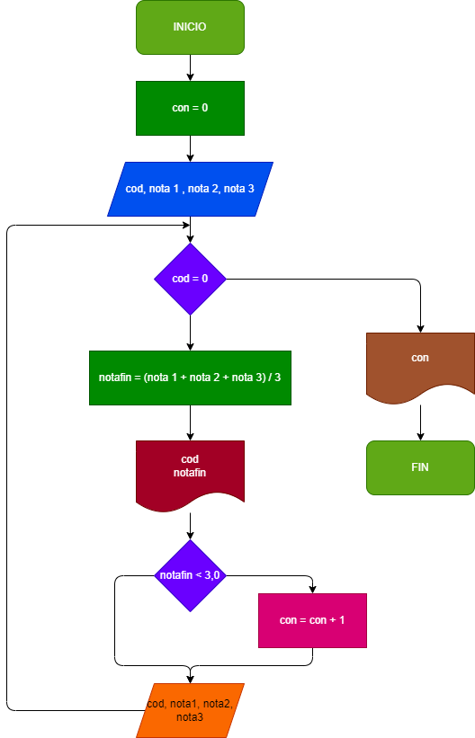
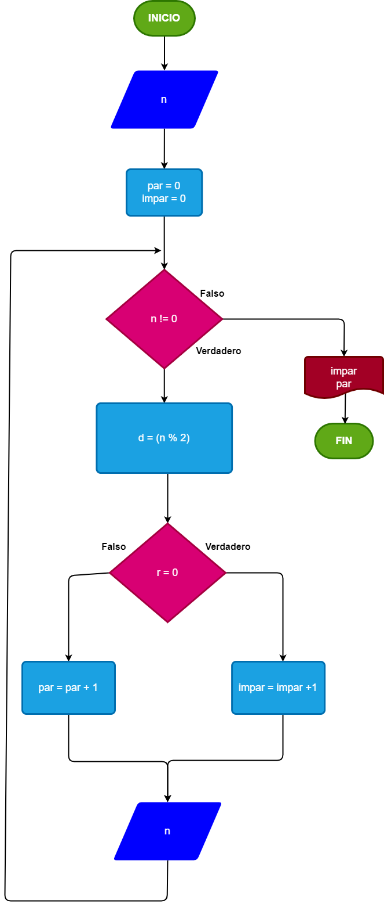

# EJERCICIOS DE CLASE 31 DE MAYO 2022

# Ejercicio 1

Hacer el diagrama de flujo y el programa en Python, que por cada estudiante lea el código, y el nombre, y las notas de los tres parciales de una materia, y que calcule e imprima el código, el nombre, y la nota final de cada estudiante. No sabemos cuántos estudiantes son, pero después de la información del último, se introduce 0 en el campo correspondiente al código, de modo tal que sirva como *centinela*, para indicar cuando terminan los datos de entrada. Támbien se debe informar al final cuántos estudiantes perdieron la materia.

# Diagrama de flujo 1

# Ejercicio 2

Hacer el diagrama de flujo y el programa en Python, que lea números enteros y positivos (uno enc ada lectura), y que averigue e imprima cuándo son pares y cuando son impares. Para terminar, utilizaremos el registro centinela, cuando el valor del número leído sea cero.

# Diagrama de flujo 2

# Ejericico 3

El cajero de un banco solo dispone de billetes de $10000 , $2000 y $100. Su funcion es cambiar los cheuqes a los clientes, dandoles el menor numero posible de billetes. Asumiendo que todos los cheques son multiplos de $100 que le informe al cajero cuantos billetes de cada, denominacion debe entregar. Como no se sabe cuantos clientes vienen en un dia, el proggrama debe terminar cuando reciba ceros como valor del cheque, y al final del dia debe informar cuantos billetes de cada denominacion se gastaron.

# Diagrama de flujo 2

