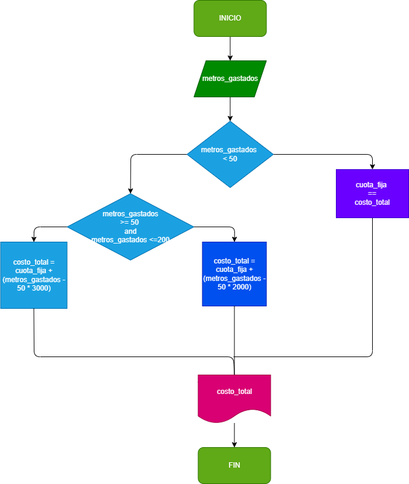

## Ejercicio 2
### calcular el gasto de agua de una vivienda, basando el gasto de m3, siendo el sistema de cobro el siguente

la cuota fija mensual es de 10.000 

los primeros 50 m3 son gratis 

entre 50 y 200 m3 se cobra el metro cubico a 2.000

a partir de 200 se cobra el metro a 3.000

## DIAGRAMA DE FLUJO
